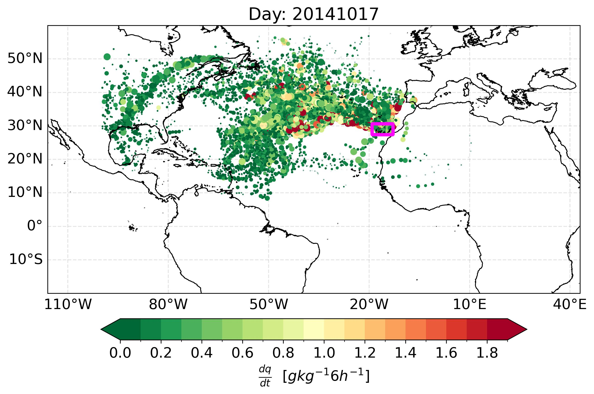
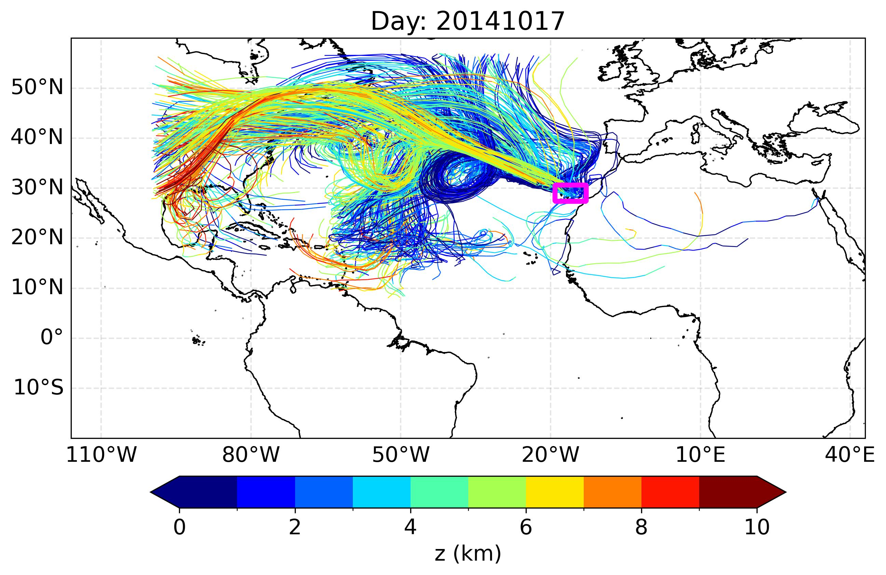
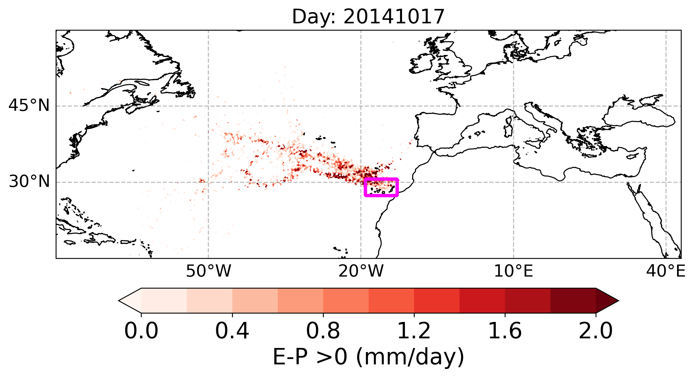
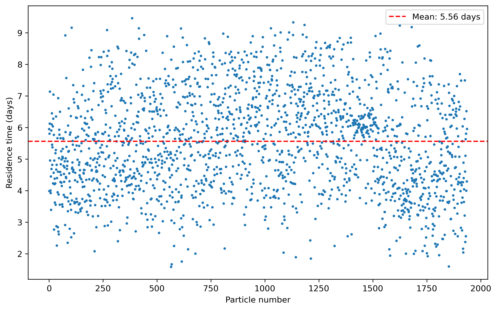

Illustrative examples for a specific day
===============================================================
Using the data corresponding to the outputs of FLEXPART-WRF forced with ERA5 
and the TROVA configuration file provided in the following repositories
https://zenodo.org/records/14886887 and https://zenodo.org/records/14939160,
the results shown below for October 17, 2014, can be reproduced. For this 
analysis, the Canary Islands are considered as the target region (magenta 
contour on the graphics shown). The Python codes
to process these results and create the corresponding maps can be found in the 
repository https://zenodo.org/records/14886887.

Below we show a detailed analysis of the results obtained when we ran TROVA
using the methodology of Sodemann et al (2008). This analysis is performed 
for a sample of 1000 particles. For this analysis, we used the files
20141017000000_dqdt_back.nc and 20141017000000_back.nc. We present four
figures with the following variables:

Specific humidity changes every 6 h for the particles
-------------------------------------------------------------------------

.. code-block:: python

   def plot_line_dq_dt(lat, lon, m_id, lat_id, lon_id, name, title):

      rcParams.update({'font.size': 15})
      fig=plt.figure(figsize=(10,8))
      ax1=plt.subplot(111,projection=ccrs.PlateCarree())
      ax1.add_feature(cfeature.COASTLINE.with_scale('10m'), linewidth=0.9)
      ax1.set_extent([-116,43,-20,60], crs=ccrs.PlateCarree())
    
      unit=r'$\frac{dq}{dt}$'  +"  "+  r'$ [g kg^{-1} 6h^{-1}]$'
      lista=np.arange(0,2, 0.1)
      cmap=plt.get_cmap('RdYlGn_r')

      boundary_norm = BoundaryNorm(lista, 
                             cmap.N)

      for i in range(len(m_id[:,0])):
        index=np.where(np.isnan(m_id[i,:]))
        if len(index[0])!=0:
            index_cero=np.where(m_id[i,:index[0][0]]==0)
            if len(index_cero[0])!=len(m_id[i,:index[0][0]]==0):
               ss=plt.scatter(lon_id[i,:index[0][0]],lat_id[i,:index[0][0]],s=(m_id[i,:index[0][0]]/np.abs(np.max(m_id[i,:index[0][0]])))*40, c=m_id[i,:index[0][0]]*1000, cmap=cmap, norm=boundary_norm)
        else:
            print (np.min(m_id[i,:]), np.max(m_id[i,:]))
            ss=plt.scatter(lon_id[i,:],lat_id[i,:],s=(m_id[i,:]/np.abs(np.max(m_id[i,:])))*40, c=m_id[i,:]*1000, cmap=cmap, norm=boundary_norm)
    
      lat_mask, lon_mask, mask = load_mask_grid_NR("CAN.nc", "mask", "lon", "lat", 2)
      ax1.contour(lon_mask, lat_mask, mask, levels=[0.5], colors='magenta', linewidths=3.5, transform=ccrs.PlateCarree())

      plt.title("Day: "+ title)
      cb=plt.colorbar(ss,orientation="horizontal", pad=0.06,shrink=0.8, extend="both")
      cb.set_label(label=unit, size=15)
      cb.ax.tick_params(labelsize=15)
      gl = ax1.gridlines(crs=ccrs.PlateCarree(), draw_labels=True,linewidth=1, color='gray', alpha=0.2, linestyle='--')
      gl.xlabels_top = False
      gl.ylabels_left = True
      gl.ylabels_right = False
      gl.xlines = True
      gl.top_labels = False   
      gl.bottom_labels = True  
      gl.left_labels = True   
      gl.right_labels = False
      gl.xlines = True
      paso_h=30
      lons=np.arange(np.ceil(-110),np.ceil(60),paso_h)
      gl.xlocator = mticker.FixedLocator(lons)
      gl.xformatter = LONGITUDE_FORMATTER
      gl.yformatter = LATITUDE_FORMATTER
      gl.xlabel_style = {'size': 15, 'color': 'gray'}
      gl.xlabel_style = {'color': 'black'}
      plt.savefig(name+".jpg", bbox_inches='tight', dpi = 300)
      plt.close()

Particle positions by day shown in colors
-----------------------------------------

The colors 'blue', 'green', 'red', 'cyan', 'magenta', 'yellow', 'black', 'purple', 'orange',
'brown' are associated with days from 10 to 1 in backward in time mode.

.. code-block:: python

   def plot_day(lat, lon, m_id, lat_id, lon_id, name, title):

      rcParams.update({'font.size': 15})
      fig=plt.figure(figsize=(10,8))
      ax1=plt.subplot(111,projection=ccrs.PlateCarree())
      ax1.add_feature(cfeature.COASTLINE.with_scale('10m'), linewidth=0.9)
      ax1.set_extent([-116,43,-20,60], crs=ccrs.PlateCarree())
      colors = ['blue', 'green', 'red', 'cyan', 'magenta', 'yellow', 'black', 'purple', 'orange', 'brown']
      
      for j in range(m_id.shape[0]):
         values = m_id[j, :]
         values_lat = lat_id[j,:]
         values_lon = lon_id[j,:]
         selected_intervals = [values[i:i+4] for i in range(0, len(values), 4)]
         selected_intervals_lat = [values_lat[i:i+4] for i in range(0, len(values_lat), 4)]
         selected_intervals_lon = [values_lon[i:i+4] for i in range(0, len(values_lon), 4)]
         for idx, (lon, lat, interval) in enumerate(zip(selected_intervals_lon, selected_intervals_lat, selected_intervals)):
            plt.scatter(lon, lat, color=colors[idx],s=0.05)
    
      lat_mask, lon_mask, mask = load_mask_grid_NR("CAN.nc", "mask", "lon", "lat", 2)
      ax1.contour(lon_mask, lat_mask, mask, levels=[0.5], colors='magenta', linewidths=3.5, transform=ccrs.PlateCarree())

      plt.title("Day: "+ title)
      gl = ax1.gridlines(crs=ccrs.PlateCarree(), draw_labels=True,linewidth=1, color='gray', alpha=0.2, linestyle='--')
      gl.xlabels_top = False
      gl.ylabels_left = True
      gl.ylabels_right = False
      gl.xlines = True
      gl.top_labels = False   
      gl.bottom_labels = True  
      gl.left_labels = True   
      gl.right_labels = False
      gl.xlines = True
      paso_h=30
      lons=np.arange(np.ceil(-110),np.ceil(60),paso_h)
      gl.xlocator = mticker.FixedLocator(lons)
      gl.xformatter = LONGITUDE_FORMATTER
      gl.yformatter = LATITUDE_FORMATTER
      gl.xlabel_style = {'size': 15, 'color': 'gray'}
      gl.xlabel_style = {'color': 'black'}
      plt.savefig(name+"_day.jpg", bbox_inches='tight', dpi = 300)
      plt.close()

.. image:: _static/point_day_part_20141017.jpg
   :alt: point_day_part
   :align: center
   :width: 400px

The trajectories of the particles and the height in colors every 6 h
--------------------------------------------------------------------

.. code-block:: python

   def plot_line_z(lat, lon, m_id, lat_id, lon_id, name, title):
    
      rcParams.update({'font.size': 15})
      fig=plt.figure(figsize=(10,8))
      ax1=plt.subplot(111,projection=ccrs.PlateCarree())
      ax1.add_feature(cfeature.COASTLINE.with_scale('10m'), linewidth=0.9)
      ax1.set_extent([-116,43,-20,60], crs=ccrs.PlateCarree())
      unit="z (km)"
      lista=np.arange(0,10.1,1)
      cmap=plt.get_cmap('jet')
      boundary_norm = BoundaryNorm(lista, 
                              cmap.N)

      for i in range(len(m_id[:,0])):
        index=np.where(np.isnan(m_id[i,:]))
        if len(index[0])!=0:
             index_cero=np.where(m_id[i,:index[0][0]]==0)
             if len(index_cero[0])!=len(m_id[i,:index[0][0]]==0):
               lc, line=colorline(lon_id[i,:index[0][0]],lat_id[i,:index[0][0]], z=m_id[i,:index[0][0]], lista=lista, cmap=cmap)
        else:
             print (np.min(m_id[i,:]), np.max(m_id[i,:]))
             lc, line=colorline(lon_id[i,:],lat_id[i,:], z=m_id[i,:], lista=lista, cmap=cmap)

      plt.title("Day: "+ title)
      lat_mask, lon_mask, mask = load_mask_grid_NR("CAN.nc", "mask", "lon", "lat", 2)
      ax1.contour(lon_mask, lat_mask, mask, levels=[0.5], colors='magenta', linewidths=3.5, transform=ccrs.PlateCarree())

      cb=plt.colorbar(lc,orientation="horizontal",pad=0.06,shrink=0.8, extend="both")
      cb.set_label(label=unit, size=15)
      cb.ax.tick_params(labelsize=15)
      gl = ax1.gridlines(crs=ccrs.PlateCarree(), draw_labels=True,linewidth=1, color='gray', alpha=0.2, linestyle='--')
      gl.xlabels_top = False
      gl.ylabels_left = True
      gl.ylabels_right = False
      gl.xlines = True
      gl.top_labels = False   
      gl.bottom_labels = True  
      gl.left_labels = True   
      gl.right_labels = False
      gl.xlines = True
      paso_h=30
      lons=np.arange(np.ceil(-110),np.ceil(60),paso_h)
      gl.xlocator = mticker.FixedLocator(lons)
      gl.xformatter = LONGITUDE_FORMATTER
      gl.yformatter = LATITUDE_FORMATTER
      gl.xlabel_style = {'size': 15, 'color': 'gray'}
      gl.xlabel_style = {'color': 'black'}
      plt.savefig(name+".jpg", bbox_inches='tight', dpi = 300)
      plt.close()

Moisture source pattern (E-P > 0)
---------------------------------

.. code-block:: python

   def plot_field(lon, lat, data, name, pallete, unit, title):

      rcParams.update({'font.size': 15})
      fig=plt.figure(figsize=(10,8))

      lon, lat = np.meshgrid(lon, lat)
      ax1 = plt.subplot(111, projection=ccrs.PlateCarree())
      ax1.set_extent([-80,43,15,60], crs=ccrs.PlateCarree())
      ax1.add_feature(cfeature.COASTLINE.with_scale('10m'), linewidth=0.9)

      band_a = 0.001
      data[np.abs(data) < band_a] = np.nan
      lat_mask, lon_mask, mask = load_landmask("CAN.nc")
      unit = unit
      cf = ax1.contourf(lon, lat, data, levels=np.arange(0, 2.2, 0.2), cmap=plt.get_cmap(pallete), extend='both', transform=ccrs.PlateCarree())
      ax1.contour(lon_mask, lat_mask, mask, levels=[0.5], colors='magenta', linewidths=3, transform=ccrs.PlateCarree())
      
      plt.title("Day: "+ title)
      cb = plt.colorbar(cf, orientation="horizontal", pad=0.06, shrink=0.8)
      cb.set_label(label=unit, size=20)
      cb.ax.tick_params(labelsize=20)
      gl = ax1.gridlines(crs=ccrs.PlateCarree(), draw_labels=True, linewidth=1, color='gray', alpha=0.5, linestyle='--')
      gl.xlabels_top = False
      gl.ylabels_left = True
      gl.ylabels_right = False
      gl.xlines = True
      gl.xlabels_top = False
      gl.ylabels_left = True
      gl.ylabels_right = False
      gl.xlines = True
      gl.top_labels = False   
      gl.bottom_labels = True  
      gl.left_labels = True   
      gl.right_labels = False
      gl.xlines = True
      paso_h = 30
      dlat = 15
      lons=np.arange(np.ceil(-110),np.ceil(60),paso_h)
      gl.xlocator = mticker.FixedLocator(lons)
      gl.ylocator = mticker.MultipleLocator(dlat)
      gl.xformatter = LONGITUDE_FORMATTER
      gl.yformatter = LATITUDE_FORMATTER
      gl.xlabel_style = {'size': 15, 'color': 'black'}
      gl.ylabel_style = {'size': 15, 'color': 'black'}
      plt.savefig(name + ".png", bbox_inches='tight', dpi=300)
      plt.close()

Water vapor residence time in the atmosphere
-----------------------------------------------

.. code-block:: python

   def plot_residence_time(residence_time_particles, residence_time_mean, output_dir, date, rank):
            
      import matplotlib.pyplot as plt
      plt.figure(figsize=(10, 6))
      plt.plot(residence_time_particles, 'o', markersize=2)
      plt.axhline(y=residence_time_mean, color='r', linestyle='--', label=f'Mean: {residence_time_mean:.2f} days')
      plt.xlabel('Particle number')
      plt.ylabel('Residence time (days)')
      plt.legend()
      plot_file = f"{output_dir}WVRT_plot_{date}.png"
      plt.savefig(plot_file, bbox_inches='tight', dpi=300)
      plt.close()
      if rank == 0:
         print("--------------------------------------------------------------------")
         print(f"Plot for the residence time for all particles saved to {plot_file}")
         print("--------------------------------------------------------------------")

