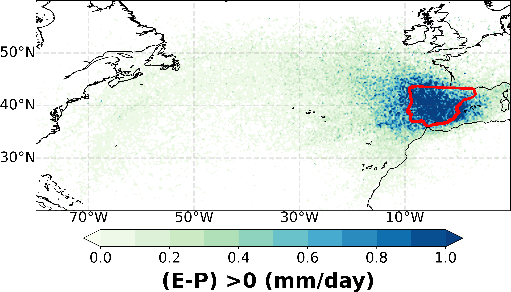

Climatological analysis
===============================================================

TROVA is used in backward in time to determine moisture sources
----------------------------------------------------------------

In this case, it is the moisture source pattern associated with the Iberian Peninsula 
for the month of October 2001. In this analysis, TROVA is used with the methodology 
of Sodemann et al. (2008) and as input data the outputs of the FLEXPART-WRF model 
forced with the Community Earth System Model 2 (CESM2) climate model. The mask used
is represented in red (the Iberian Peninsula itself).

TROVA is used in forward in time to determine the moisture sinks
----------------------------------------------------------------

The following Figure presents the moisture sink pattern associated with the Mediterranean 
Sea for the month of October 2014. The methodology of Stohl and James (2005) is considered 
and how it masks the geographical limits of the Mediterranean Sea. The input data for TROVA 
are the outputs of FLEXPART forced with ERA-Interim.

.. image:: _static/Fig2-git.png
   :alt: Moisture Sink
   :align: center
   :width: 400px

