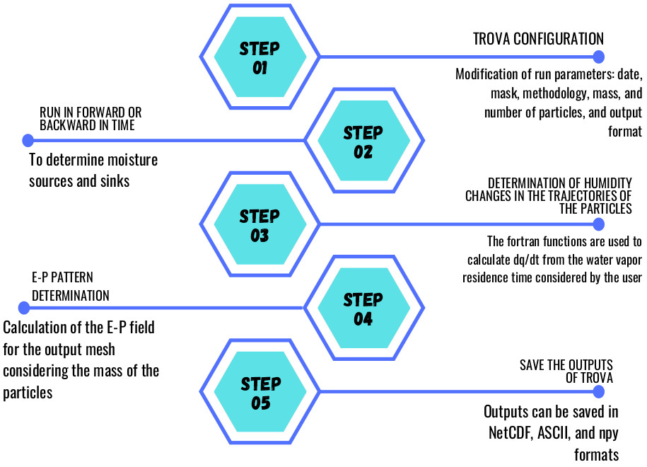

TROVA: TRansport Of water VApor
=================================
TRansport Of water VApor (TROVA) is a software developed in Python and Fortran
for the study of moisture sources and sinks. It has been developed within the LAGRIMA and 
SETESTRELO projects at the EPhysLab (Environmental Physics Laboratory) at the University of Vigo. 
Subsequently, its development and updating has continued within a collaboration from the University 
of Vigo and the Galician Supercomputing Center. Many investigations use this software to obtain scientific results. 
These can be consulted at the following web address: `EPhysLab Website <https://ephyslab.uvigo.es/en/staff/>`_. 
**This is an update of the software presented by Fernández-Alvarez et al. (2022)**

.. code-block:: none

    *****************************************************************************************
    *                    EPhysLab (Environmental Physics Laboratory)                        *
    *                        Galician Supercomputing Center, Spain                          *
    *                        TRansport Of water VApor (TROVA)                               *
    *                             version 1.1 (12-02-2025)                                  *
    *                        _____ __    ____                                               *
    *                          |  |  |  /    \ \        //\                                 *
    *                          |  |__| /      \ \      //__\                                *
    *                          |  |  \ \      /  \    //    \                               *
    *                          |  |   \ \____/    \__//      \                              *
    *                                                                                       *
    *                             Edificio Campus da Auga                                   *
    *                             University of Vigo/CESGA                                  *
    *                          www.ephyslab.uvigo.es/www.cesga.es                           *
    *      contact: jose.carlos.fernandez.alvarez@uvigo.es (jcfernandez@cesga.es),          * 
    *                         albenis.perez.alarcon@uvigo.es                                *
    *****************************************************************************************

TROVA Software architecture 
------------------------------------

TROVA allows the use of the FLEXible PARTicle global dispersion model and the FLEXPART-WRF 
regional model at different spatial resolutions. It also include the methodologies 
of Stohl and James (2005) and Sodemann et al. (2008). We herein refer to these methodologies
as STHOL2005 and SOD2008 respectively. It contains two main modules:

1- Developed in Python that is responsible for reading the files, configuring TROVA
and generating the outputs of the moisture budget *(Evaporation (E)-Precipitation (P))* 
for the number of days selected in the simulations.

2- Developed in Fortran that is used in interface with Python so that the calculations 
of great computational demand are carried out in the shortest possible time. It also 
includes a parallel implementation using the MPI library to reduce TROVA processing time.

3- This new version includes the analysis of moisture sources and sinks by vertical layers.

For a more detailed understanding of TROVA, Figure 1 presents a flowchart where the general 
algorithm of the software is explained. The first step that must be carried out corresponds 
to the configuration of the input file where the run parameters are established. The second 
is to run the model forward or backward in time to determine moisture sources and sinks. The 
tracking mode is defined in the input file. The third step corresponds to TROVA where it reads 
the necessary files for tracking the particles, then performs the calculations of the changes 
in humidity of the particles using the functions developed in Fortran. These will allow greater
computational efficiency and decrease the run time. The fourth step is calculating the E-P field 
on the output mesh defined by the user from the Stohl and James (2005) equation. Finally, TROVA 
saves the output in the user-defined format, which can be NetCDF, ASCII, or any.

TROVA software functionalities  
--------------------------------

TROVA allows the study of moisture sources and sinks based on calculation of the E-P fields, 
using the main methodologies of Stohl and James (2005) and Sodemann et al. [2008]. In addition, TROVA 
provides the advantage of using different numerical outputs from FLEXPART and FLEXPART-WRF at 
different spatial resolutions, ensuring better representation of the E-P field to be obtained. 
Table 1 shows a comparison of TROVA with other software available to the scientific community: 
WaterSip (Fremme and Sodemann, 2019) and HAMSTER (Keune et al., 2022), in which the main 
differences/advantages can be observed. For more details, consult the article: Fernández-Alvarez et al. (2022).

+-------------------------------------------+-------------------+-------------------+-------------------+
| **Comparison parameters**                 | **TROVA**         | **WaterSip**      | **HAMSTER**       |
+-------------------------------------------+-------------------+-------------------+-------------------+
| Input data                                |Outputs of the     | Outputs of the    |Outputs of the     |
|                                           |FLEXPART and       | FLEXPART and      |FLEXPART model     |
|                                           |FLEXPART-WRF forced| LAGRANTO forced   |forced             |
|                                           |with reanalysis and| with reanalysis   |with reanalysis    |
|                                           |climatic scenarios |                   |                   |
+-------------------------------------------+-------------------+-------------------+-------------------+
| Input data spatial resolution             |Several (e.g. 1°,  |1°                 |1°                 |
|                                           |0.25°, and 0.18°)  |                   |                   |
+-------------------------------------------+-------------------+-------------------+-------------------+
| Output data spatial resolution            |Several (e.g. 1°,  | 1°                | 1°                |
|                                           |0.25°, and 0.18°)  |                   |                   |
+-------------------------------------------+-------------------+-------------------+-------------------+
| Lagrangian methodologies implemented      |STHOL2005, SOD2008 |SOD2008            |SOD2008 plus bias  |
|                                           |                   |                   |correction based   |
|                                           |                   |                   |on source–receptor |
|                                           |                   |                   |relationships      |
+-------------------------------------------+-------------------+-------------------+-------------------+
| Use for related studies with future       | Yes               | No                | No                |
+-------------------------------------------+-------------------+-------------------+-------------------+
| Parallelization                           | Yes               | Yes               | No                |
+-------------------------------------------+-------------------+-------------------+-------------------+
| Adapted for High-performance computing    | Yes               | Yes               | No                |
+-------------------------------------------+-------------------+-------------------+-------------------+
|E-P pattern by vertical layers             | Yes               | No                |No                 |
+-------------------------------------------+-------------------+-------------------+-------------------+

TROVA software validation
----------------------------------------
The TROVA software has been widely validated in the analysis of moisture sources from tropical and 
extratropical cyclones and atmospheric rivers for the North Atlantic basin using the methodologies 
mentioned above, sometimes for future climate. In these studies, the outputs of FLEXPART forced with 
ERA-Interim, ERA5, and climate scenarios were used as input data. In addition, it was evaluated using 
the methodology of Stohl and James [4] for climatological studies of the moisture sources contributing
to the Iberian Peninsula and for sinks associated with the sources in the North Atlantic Ocean and the 
Mediterranean Sea. These results can be consulted in Fernandez-Alvarez et al. (2023).

TROVA impact
----------------------------------------

The moisture transport from ocean sources to the continents forms the link between evaporation from the ocean
and precipitation over the continents, thus establishing the moisture source–sink relationship. In the 
context of climate change, a change in moisture transport is associated with the moisture increase derived 
from the increment of temperature. Therefore, the study of moisture transport is crucial for a better
understanding of the observed changes and those derived from projections of future climate data. 
Therefore, it is important to have a set of tools for Lagrangian post-processing of different model outputs.
Specifically, TROVA enables the user community to post-process these model outputs in present and future times 
to understand changes in the hydrological cycle. In addition, TROVA allows for the two main Lagrangian methodologies 
established in literature to be integrated into a single tool, thus facilitating comparison of the results obtained 
and proposing more conclusive results for the scientific community.

References
----------------------------------------

[1] Stohl A, James PA. A Lagrangian analysis of the atmospheric branch of the global water cycle: Part II:
Earth’s river catchments ocean basins, and moisture transports between them. J. Hydrometeorol. 2005; 6:961–984.
https://doi.org/10.1175/JHM470.1.

[2] Sodemann H, Schwierz C, Wernli H. Interannual variability of Greenland winter precipitation sources: 
Lagrangian moisture diagnostic and North Atlantic Oscillation influence. J. Geophys. Res.-Atmos. 2008; 
113:D03107. https://doi.org/10.1029/2007JD008503.

[3] Fernández-Alvarez, J. C., Pérez-Alarcón, A., Nieto, R., & Gimeno, L. (2022). TROVA: TRansport of water VApor. 
SoftwareX, 20, 101228. https://doi.org/10.1016/j.softx.2022.101228.

[4] Keune J, Schumacher DL., Miralles DG. A unified framework to estimate the origins of atmospheric 
moisture and heat using Lagrangian models. Geosci. Model Dev. 2022; 15:1875-1898.https://doi.org/10.5194/gmd-15-1875-2022.

[5] Fremme A, Sodemann H. The role of land and ocean evaporation on the variability of precipitation 
in the Yangtze River valley. Hydrol. Earth Syst. Sci. 2019; 23:2525-2540.https://doi.org/10.5194/hess-23-2525-2019.

[6] Fernández-Alvarez, J.C., Pérez-Alarcón, A., Eiras-Barca, J. et al. Projected changes in atmospheric moisture 
transport contributions associated with climate warming in the North Atlantic. Nat Commun 14, 6476 (2023). 
https://doi.org/10.1038/s41467-023-41915-1
